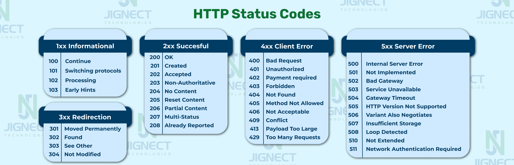

# HTTP Статус-коды



## Оглавление
- [Введение](#введение)
- [Категории статус-кодов](#категории-статус-кодов)
- [1xx - Информационные](#1xx---информационные)
- [2xx - Успешные](#2xx---успешные)
- [3xx - Перенаправление](#3xx---перенаправление)
- [4xx - Ошибки клиента](#4xx---ошибки-клиента)
- [5xx - Ошибки сервера](#5xx---ошибки-сервера)
- [Самые популярные коды](#самые-популярные-коды)

## Введение

HTTP статус-коды - это трёхзначные числа, которые сервер возвращает в ответ на HTTP-запрос клиента. Они указывают на результат обработки запроса и помогают понять, что произошло при взаимодействии клиента и сервера.

Первая цифра кода определяет класс ответа:
- **1xx** - Информационные
- **2xx** - Успешные
- **3xx** - Перенаправление
- **4xx** - Ошибки клиента
- **5xx** - Ошибки сервера

---

## Категории статус-кодов

### 1xx - Информационные

Эти коды указывают, что запрос получен и обрабатывается. Используются редко.

#### 100 Continue
- **Описание**: Сервер получил заголовки запроса и клиент может продолжить отправку тела запроса
- **Применение**: При отправке больших данных с предварительной проверкой
- **Пример**: Загрузка больших файлов

#### 101 Switching Protocols
- **Описание**: Сервер переключается на протокол, указанный клиентом в заголовке Upgrade
- **Применение**: Переключение с HTTP на WebSocket
- **Пример**: Установка WebSocket соединения

#### 102 Processing (WebDAV)
- **Описание**: Сервер принял запрос и обрабатывает его, но ответа пока нет
- **Применение**: Длительные операции WebDAV

#### 103 Early Hints
- **Описание**: Отправка предварительных заголовков до основного ответа
- **Применение**: Оптимизация загрузки ресурсов (preload)

---

### 2xx - Успешные 

Запрос успешно получен, понят и обработан.

#### 200 OK  (САМЫЙ ПОПУЛЯРНЫЙ)
- **Описание**: Запрос выполнен успешно
- **Применение**: Стандартный успешный ответ
- **Тело ответа**: Содержит запрошенные данные
- **Методы**: GET, POST, PUT, PATCH
- **Пример**:
  ```
  GET /api/users/1
  → 200 OK
  { "id": 1, "name": "John" }
  ```

#### 201 Created
- **Описание**: Запрос выполнен, новый ресурс создан
- **Применение**: Создание новой записи
- **Заголовок**: Location с URL созданного ресурса
- **Методы**: POST, PUT
- **Пример**:
  ```
  POST /api/users
  → 201 Created
  Location: /api/users/42
  ```

#### 202 Accepted
- **Описание**: Запрос принят, но ещё не обработан
- **Применение**: Асинхронная обработка, очереди задач
- **Пример**: Отправка email, обработка видео

#### 203 Non-Authoritative Information
- **Описание**: Ответ от прокси-сервера с модифицированными заголовками
- **Применение**: Редко используется

#### 204 No Content
- **Описание**: Запрос выполнен успешно, но нет содержимого для отправки
- **Применение**: DELETE операции, обновления без возврата данных
- **Тело ответа**: Отсутствует
- **Пример**:
  ```
  DELETE /api/users/1
  → 204 No Content
  ```

#### 205 Reset Content
- **Описание**: Сбросить документ (форму)
- **Применение**: Очистка формы после отправки

#### 206 Partial Content
- **Описание**: Частичное содержимое (Range-запрос)
- **Применение**: Докачка файлов, потоковое видео
- **Заголовок**: Content-Range
- **Пример**: Стриминг, загрузка по частям

---

### 3xx - Перенаправление 

Клиент должен предпринять дополнительные действия для завершения запроса.

#### 300 Multiple Choices
- **Описание**: Есть несколько вариантов ресурса
- **Применение**: Выбор языка, формата

#### 301 Moved Permanently 
- **Описание**: Ресурс перемещён навсегда
- **Применение**: Изменение структуры URL, миграция сайта
- **Заголовок**: Location с новым URL
- **SEO**: Передаёт вес страницы
- **Кеширование**: Браузеры кешируют
- **Пример**:
  ```
  GET /old-page
  → 301 Moved Permanently
  Location: /new-page
  ```

#### 302 Found (Temporary Redirect) 
- **Описание**: Временное перенаправление
- **Применение**: Временные изменения, A/B тестирование
- **Заголовок**: Location
- **SEO**: Не передаёт вес страницы
- **Пример**: Перенаправление на страницу обслуживания

#### 303 See Other
- **Описание**: Ответ находится по другому URI (только GET)
- **Применение**: Редирект после POST (POST-Redirect-GET паттерн)
- **Пример**: После отправки формы перенаправление на страницу результата

#### 304 Not Modified 
- **Описание**: Ресурс не изменился с последнего запроса
- **Применение**: HTTP кеширование
- **Заголовки**: If-Modified-Since, If-None-Match, ETag
- **Оптимизация**: Экономит трафик
- **Пример**:
  ```
  GET /style.css
  If-None-Match: "abc123"
  → 304 Not Modified
  ```

#### 307 Temporary Redirect
- **Описание**: Временное перенаправление с сохранением метода
- **Отличие от 302**: Метод запроса не меняется
- **Применение**: Временное перенаправление POST-запросов

#### 308 Permanent Redirect
- **Описание**: Постоянное перенаправление с сохранением метода
- **Отличие от 301**: Метод запроса не меняется
- **Применение**: Миграция API с сохранением POST/PUT

---

### 4xx - Ошибки клиента 

Запрос содержит ошибку или не может быть выполнен.

#### 400 Bad Request 
- **Описание**: Некорректный синтаксис запроса
- **Применение**: Невалидный JSON, неправильные параметры
- **Пример**:
  ```json
  {
    "error": "Invalid JSON format",
    "details": "Expected '}' at line 5"
  }
  ```

#### 401 Unauthorized 
- **Описание**: Требуется аутентификация
- **Применение**: Отсутствие/невалидный токен, истёк JWT
- **Заголовок**: WWW-Authenticate
- **Название**: Некорректное (должно быть Unauthenticated)
- **Пример**:
  ```
  GET /api/profile
  → 401 Unauthorized
  WWW-Authenticate: Bearer realm="API"
  ```

#### 402 Payment Required
- **Описание**: Зарезервирован для будущего использования
- **Применение**: Платные API, микроплатежи

#### 403 Forbidden 
- **Описание**: Доступ запрещён (аутентификация есть, но прав нет)
- **Применение**: Недостаточно прав, IP заблокирован
- **Отличие от 401**: Пользователь известен, но прав недостаточно
- **Пример**:
  ```json
  {
    "error": "You don't have permission to access this resource"
  }
  ```

#### 404 Not Found 
- **Описание**: Ресурс не найден
- **Применение**: Несуществующий URL, удалённый ресурс
- **Безопасность**: Может скрывать существование приватных ресурсов вместо 403
- **Пример**:
  ```
  GET /api/users/99999
  → 404 Not Found
  { "error": "User not found" }
  ```

#### 405 Method Not Allowed 
- **Описание**: HTTP-метод не поддерживается для данного ресурса
- **Заголовок**: Allow (список разрешённых методов)
- **Пример**:
  ```
  POST /api/config
  → 405 Method Not Allowed
  Allow: GET, PUT
  ```

#### 406 Not Acceptable
- **Описание**: Сервер не может вернуть данные в запрошенном формате
- **Заголовок**: Accept
- **Пример**: Клиент запросил XML, сервер поддерживает только JSON

#### 407 Proxy Authentication Required
- **Описание**: Требуется аутентификация прокси-сервера
- **Применение**: Корпоративные прокси

#### 408 Request Timeout
- **Описание**: Сервер не дождался запроса от клиента
- **Применение**: Медленное соединение

#### 409 Conflict 
- **Описание**: Конфликт с текущим состоянием ресурса
- **Применение**: Конкурентное изменение, нарушение бизнес-логики
- **Пример**:
  ```json
  {
    "error": "Email already exists",
    "field": "email"
  }
  ```

#### 410 Gone
- **Описание**: Ресурс удалён безвозвратно
- **Отличие от 404**: Известно, что ресурс существовал раньше
- **SEO**: Удаляет страницу из индекса

#### 411 Length Required
- **Описание**: Требуется заголовок Content-Length
- **Применение**: Загрузка файлов

#### 412 Precondition Failed
- **Описание**: Условие в заголовках не выполнено
- **Заголовки**: If-Match, If-Unmodified-Since
- **Применение**: Оптимистичная блокировка

#### 413 Payload Too Large 
- **Описание**: Размер запроса превышает лимит сервера
- **Применение**: Слишком большой файл, большой JSON
- **Пример**: Загрузка файла >10MB при лимите 5MB

#### 414 URI Too Long
- **Описание**: URL слишком длинный
- **Применение**: Слишком много GET-параметров

#### 415 Unsupported Media Type 
- **Описание**: Неподдерживаемый тип содержимого
- **Заголовок**: Content-Type
- **Пример**: Отправка XML вместо JSON

#### 416 Range Not Satisfiable
- **Описание**: Диапазон в заголовке Range не может быть обработан
- **Применение**: Докачка файлов

#### 417 Expectation Failed
- **Описание**: Ожидание в заголовке Expect не может быть выполнено

#### 418 I'm a teapot 
- **Описание**: Пасхалка (RFC 2324 - HTCPCP)
- **Применение**: Шутка, иногда используется как заглушка

#### 421 Misdirected Request
- **Описание**: Запрос направлен на сервер, который не может дать ответ
- **Применение**: HTTP/2

#### 422 Unprocessable Entity 
- **Описание**: Синтаксис верен, но семантическая ошибка
- **Применение**: Валидация данных (email неправильного формата)
- **Пример**:
  ```json
  {
    "errors": {
      "email": ["Invalid email format"],
      "age": ["Must be between 18 and 120"]
    }
  }
  ```

#### 423 Locked (WebDAV)
- **Описание**: Ресурс заблокирован
- **Применение**: WebDAV

#### 424 Failed Dependency (WebDAV)
- **Описание**: Зависимый запрос завершился неудачно

#### 425 Too Early
- **Описание**: Сервер не готов обработать запрос
- **Применение**: TLS Early Data

#### 426 Upgrade Required
- **Описание**: Клиент должен переключиться на другой протокол
- **Заголовок**: Upgrade
- **Пример**: Требуется HTTPS вместо HTTP

#### 428 Precondition Required
- **Описание**: Требуется условный запрос
- **Применение**: Предотвращение потери обновлений

#### 429 Too Many Requests 
- **Описание**: Превышен лимит запросов (rate limiting)
- **Заголовки**: Retry-After, X-RateLimit-*
- **Применение**: API rate limiting, защита от DDoS
- **Пример**:
  ```
  → 429 Too Many Requests
  Retry-After: 60
  X-RateLimit-Limit: 1000
  X-RateLimit-Remaining: 0
  X-RateLimit-Reset: 1640000000
  ```

#### 431 Request Header Fields Too Large
- **Описание**: Заголовки запроса слишком большие
- **Применение**: Слишком много cookies

#### 451 Unavailable For Legal Reasons
- **Описание**: Доступ запрещён по юридическим причинам
- **Применение**: Цензура, GDPR, блокировки
- **Пример**: Контент недоступен в определённой стране

---

### 5xx - Ошибки сервера 

Сервер не смог выполнить корректный запрос.

#### 500 Internal Server Error (ОЧЕНЬ ПОПУЛЯРНЫЙ)
- **Описание**: Общая ошибка сервера
- **Применение**: Необработанное исключение, ошибка в коде
- **Логирование**: Обязательно логировать
- **Пример**:
  ```json
  {
    "error": "Internal Server Error",
    "requestId": "abc-123-def"
  }
  ```

#### 501 Not Implemented
- **Описание**: Сервер не поддерживает функциональность
- **Применение**: Неизвестный HTTP-метод
- **Пример**: Сервер не поддерживает метод TRACE

#### 502 Bad Gateway 
- **Описание**: Некорректный ответ от upstream-сервера
- **Применение**: Проблемы с прокси, load balancer
- **Архитектура**: nginx → application server (приложение недоступно)
- **Пример**: Backend-сервер вернул некорректный ответ

#### 503 Service Unavailable 
- **Описание**: Сервер временно недоступен
- **Заголовок**: Retry-After
- **Применение**: 
  - Перегрузка сервера
  - Техническое обслуживание
  - Деплой
- **Пример**:
  ```
  → 503 Service Unavailable
  Retry-After: 3600
  { "message": "Under maintenance" }
  ```

#### 504 Gateway Timeout 
- **Описание**: Таймаут при ожидании ответа от upstream-сервера
- **Применение**: Backend не ответил вовремя
- **Архитектура**: nginx не дождался ответа от приложения
- **Пример**: База данных не отвечает

#### 505 HTTP Version Not Supported
- **Описание**: Версия HTTP не поддерживается
- **Применение**: Устаревший протокол

#### 506 Variant Also Negotiates
- **Описание**: Ошибка конфигурации content negotiation
- **Применение**: Редко

#### 507 Insufficient Storage (WebDAV)
- **Описание**: Недостаточно места
- **Применение**: WebDAV, файловые операции

#### 508 Loop Detected (WebDAV)
- **Описание**: Обнаружена бесконечная петля
- **Применение**: WebDAV

#### 510 Not Extended
- **Описание**: Требуются дополнительные расширения

#### 511 Network Authentication Required
- **Описание**: Требуется аутентификация в сети
- **Применение**: Captive портал (Wi-Fi в кафе, аэропортах)

---

## Самые популярные коды

### ТОП-10 в веб-разработке

#### 1. 200 OK 
**Частота**: 70-80% всех запросов
- Стандартный успешный ответ
- Используется везде: GET, POST с возвратом данных
- **Best Practice**: Использовать для всех успешных операций чтения и обновления с возвратом данных

#### 2. 404 Not Found 
**Частота**: 10-15% запросов
- Второй по частоте код
- Несуществующие страницы, удалённые ресурсы
- **Best Practice**: Возвращать дружелюбное сообщение с подсказками

#### 3. 500 Internal Server Error 
**Частота**: 1-5% (в идеале < 0.1%)
- Критичная ошибка
- Требует немедленного исправления
- **Best Practice**: Всегда логировать, не показывать детали клиенту

#### 4. 401 Unauthorized 
**Частота**: Зависит от типа приложения
- Ключевой код для защищённых API
- Истекшие токены, отсутствие авторизации
- **Best Practice**: Возвращать при любых проблемах с аутентификацией

#### 5. 403 Forbidden 
**Частота**: Средняя
- Недостаточно прав
- Важен для систем с ролями
- **Best Practice**: Чётко отличать от 401

#### 6. 201 Created 
**Частота**: Высокая в REST API
- Создание ресурсов
- Обязателен для RESTful API
- **Best Practice**: Включать заголовок Location

#### 7. 204 No Content 
**Частота**: Средняя
- DELETE операции
- Обновления без возврата данных
- **Best Practice**: Не включать тело ответа

#### 8. 400 Bad Request 
**Частота**: Высокая в API
- Валидация входных данных
- Некорректный формат
- **Best Practice**: Включать детальное описание ошибки

#### 9. 301/302 Redirects 
**Частота**: Средняя
- SEO оптимизация
- Изменение структуры сайта
- **Best Practice**: 301 для постоянных, 302 для временных

#### 10. 503 Service Unavailable 
**Частота**: Низкая (но важная)
- Техническое обслуживание
- Перегрузка
- **Best Practice**: Включать Retry-After

---

## Best Practices и рекомендации

### Правильное использование

#### REST API
```
GET    /users      → 200 OK (список)
GET    /users/1    → 200 OK (один объект) / 404 Not Found
POST   /users      → 201 Created + Location header
PUT    /users/1    → 200 OK (с телом) / 204 No Content
PATCH  /users/1    → 200 OK (с телом) / 204 No Content
DELETE /users/1    → 204 No Content / 200 OK
```

#### Аутентификация и авторизация
```
Нет токена           → 401 Unauthorized
Невалидный токен     → 401 Unauthorized
Истёк токен          → 401 Unauthorized
Недостаточно прав    → 403 Forbidden
Ресурс не найден     → 404 Not Found (или 403 для безопасности)
```

#### Валидация
```
Невалидный JSON      → 400 Bad Request
Ошибки валидации     → 422 Unprocessable Entity
Конфликт данных      → 409 Conflict
Слишком большой файл → 413 Payload Too Large
```

#### Rate Limiting
```
Превышен лимит       → 429 Too Many Requests
+ заголовки:
  X-RateLimit-Limit: 1000
  X-RateLimit-Remaining: 0
  X-RateLimit-Reset: 1640000000
  Retry-After: 60
```

### Различия похожих кодов

#### 401 vs 403
- **401**: Пользователь не аутентифицирован (нет/невалидный токен)
- **403**: Пользователь аутентифицирован, но прав недостаточно

#### 404 vs 410
- **404**: Ресурс не найден (может появиться позже)
- **410**: Ресурс удалён навсегда

#### 301 vs 302 vs 307 vs 308
- **301**: Постоянное перенаправление, метод может измениться на GET
- **302**: Временное перенаправление, метод может измениться на GET
- **307**: Временное перенаправление, метод сохраняется
- **308**: Постоянное перенаправление, метод сохраняется

#### 400 vs 422
- **400**: Синтаксическая ошибка (невалидный JSON, неправильные заголовки)
- **422**: Семантическая ошибка (валидация бизнес-правил)

#### 502 vs 504
- **502**: Upstream-сервер вернул некорректный ответ
- **504**: Upstream-сервер не ответил вовремя (таймаут)

### Кеширование

#### Cacheable коды (по умолчанию)
- 200, 203, 204, 206
- 300, 301, 308
- 404, 405, 410, 414
- 501

#### Заголовки для кеширования
```
Cache-Control: max-age=3600, public
ETag: "abc123"
Last-Modified: Wed, 15 Feb 2026 10:00:00 GMT
Expires: Wed, 15 Feb 2026 11:00:00 GMT
```

### Мониторинг

#### Метрики для отслеживания
- **2xx rate**: Должен быть > 95%
- **4xx rate**: Зависит от приложения (5-10%)
- **5xx rate**: Должен быть < 0.1%
- **Latency**: p50, p95, p99

#### Алерты
- Spike в 5xx → критичный
- Spike в 4xx → проверить
- Падение 2xx → критичный

---

## Заключение

### Ключевые моменты

1. **Выбор правильного кода** - ключ к понятному API
2. **Консистентность** - используйте коды единообразно
3. **Информативность** - включайте детали в тело ответа
4. **Безопасность** - не раскрывайте лишнюю информацию в 5xx
5. **Мониторинг** - отслеживайте соотношение кодов

### Чек-лист для ревью API

- ✅ 200 для успешного GET/PUT/PATCH с данными
- ✅ 201 для POST создания ресурса + Location
- ✅ 204 для DELETE и операций без возврата данных
- ✅ 400 для синтаксических ошибок
- ✅ 401 для проблем с аутентификацией
- ✅ 403 для проблем с авторизацией
- ✅ 404 для несуществующих ресурсов
- ✅ 422 для ошибок валидации
- ✅ 429 для rate limiting
- ✅ 500 для внутренних ошибок (с логированием)
- ✅ 503 для технического обслуживания

### Полезные ссылки
- [MDN HTTP Status Codes](https://developer.mozilla.org/en-US/docs/Web/HTTP/Status)
- [httpstatuses.com](https://httpstatuses.com/) - справочник с примерами
